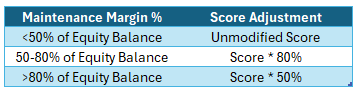

<div align="center">
  
# **EfficientFrontier-SignalPlus**
  
</div>

## Introduction
> Efficient Frontier: a set of optimal portfolios that offer the highest expected return for a defined level of risk, or the lowest risk for a given level of expected return.

Efficient Frontier is a project initiated by SignalPlus and Bittensor, designed to identify the optimal risk-weighted trading strategies through the integration of decentralized machine learning networks and live trading data. This project will leverage Bittensor's innovative blockchain-powered AI learning protocol to advance our journey in discovering optimal crypto trading strategies. Furthermore, through the use of SignalPlus' market-leading platform, every day users will now be equipped with a professional trading toolkit that is available right on their desktop, enabling true democratised access and empowering the open-access initiative.

### What is Bittensor?
Bittensor is a decentralized protocol specifically designed for machine learning (ML) and artificial intelligence (AI). It offers a unique marketplace for both users and providers of ML algorithms, utilizing a decentralized network to facilitate the exchange of these resources. More than just a marketplace for ML models, Bittensor provides a platform for training these models in a censorship-resistant environment, challenging the resource-intensive monopolies of tech giants.

At the core of Bittensor is its distinctive architecture, which combines specialized subnets for AI tasks, a blockchain for decentralized operations, and an API for seamless integration. This structure is considered crucial in positioning Bittensor as the leading network for AI services, catering to both individuals and corporations, with its native token, TAO, serving as the medium for transactions. As the network evolves, its goal is to accelerate the growth of AI by making sophisticated ML models accessible to a broader audience.

### Powering a Trading Nexus with SignalPlus
Built by an exceptional team of former banking and technology veterans, the SignalPlus terminal is the industry's leading derivative trading and options risk management platform that is well recognized by crypto's largest players and exchanges.  With a professional suite of automated and industrial-grade tools available to all, we now have a ready-made platform and built-in measurement tools to power the Bittensor network.

Never has such a level-playing field been offered to the every day user, allowing each trader to focus on refining their craft rather than being inhibited by inadequate tools.  As a result, traders are empowered to develop better trading frameworks rather than risk tools, ensuring better trading results and quality data to train the machine learning processes.

## Design Ethos
### Defining 'Risk-Adjusted Returns'
The quest for quality alpha and risk-adjusted returns has been a never-ending pursuit in the world of financial investments.  Risks are defined differently for different folks, and target returns will vary across people with different time horizons, financial circumstances, and available choices.

However, capital preservation, efficient capital use, and high multiple returns are baseline concepts that should resonate with every investor, and sensible guidelines can be developed to separate a good money manager from another.

Ultimately, every investor is looking for some combination of trading's own 'impossible-trinity':
> [!NOTE]
> 1. Return --> High returns
> 2. Risk control --> Minimal drawdowns
> 3. Time --> Getting your money back earlier

In response, we have developed a ranking system that evaluates the 3 parameters in a normalized way that can accommodate different trading styles.

### Paper Returns vs Actual Performance
Traders are performance driven practitioners seeking quantifiable results, and are particularly in-tune with an increasingly data-driven world.  While academic literature provides value in its own way, there can be no substitute for actual performance, with the SignalPlus platform perfectly suited to provide the type of quality-filtered data that is needed to derive our crowd-driven, crypto-trading Efficient Frontier.

### Other Design Considerations
There are further considerations that we have incorporated in designing our ranking model:
- Trading Environment & Behavioural Limits: we are cognizant that our decentralized trading environment is fundamentally different than, say, a professional multi-strat hedge-fund, where their PMs are bound by the rules of employment with clear limits of what they are allowed or not allowed to trade.
- Unconstrained User Entry & Exits: in the open-access world of crypto and networked mining, users are free to deploy their own trading frameworks with unrestrained entry and exit points, unlike 'fixed' measurement periods and fiscal periods for professional managers.
- Single Strategies vs Diversified Portfolios:  our strategies are evaluated on a standalone rather than on a portfolio wide basis.  Benefits of portfolio hedging and diversification must be done on an individual basis rather than across 'PMs'.
- Time Horizon & Risk Preference: The measurement timeframes that our users would prefer are likely to be significantly shorter than a typical long-only manager,and with a more ambitious risk-return preference that is more representative of crypto.
- Model Elegance & Simplicity: We will work within the limits of the dataset we are working with within a decentralized trading environment, and have designed a model that is grounded in simple practicality, where its construction and results can be easily appreciated by even the casual observer.

## The SignalPlus Value Proposition
More so than many other projects, Efficient Frontier is a comprehensive initiative that relies on the unique infrastructure and capabilities of SignalPlus to ensure the integrity and accuracy of trading data. Current on-chain data infrastructure is not yet at the point where it can be used seamlessly or efficiently to deduce optimal trading strategies on its own, and this is where SignalPlus comes in.
### 1. Authenticity of Trading Data
In any performance evaluation, the authenticity of the trading data is paramount. On-chain data alone is not able to recognize trading irregularities or factitious trades that were made to 'game' the system.

If miners were allowed to upload their own trading records, there is no reliable way to ensure those records weren’t fabricated. Miners could simply generate false data to inflate their performance, making the entire system vulnerable to manipulation.

At the same time, it would be unrealistic for miners to give validators direct access to their personal trading accounts, given obvious security and privacy concerns.  This is where SignalPlus can help to break the deadlock to act as a neutral but trusted conduit to verify trading records.

**SignalPlus will act as a trusted intermediary** through its integrated connectivity with all the major trading exchanges. The platform is technically capable of verifying all trading data to ensure that they are from real accounts with commercial executions, ensuring the sanctity of PNL records.

The platform will strive to ensure the fairness and integrity of the competition, allowing the Bittensor subnet to operate with trustworthy data and develop reliable results.

### 2. Professional Trading Infrastructure
SignalPlus is a professionally recognized and trusted partner with most of crypto's largest exchanges, offering a comprehensive suite of trading tools and risk management features available to every user. Traders can utilize the SignalPlus platform to execute complex and algorithmic trades in a systematic way, freeing up their focus to refine trading frameworks and higher cognitive functions that ultimately generate true alpha.

Some of SignalPlus's advanced trading functions include:
- **Stop Loss/Take Profit**
- **Iceberg Orders**
- **Balance Trade**
- **TWAP (Time-Weighted Average Price)**
- **DDH (Dynamic Delta Hedging)**

In a nutshell, the **SignalPlus platform dramatically lowers the barriers to entry**, and directly expands the group of participating subnet miners into the Bittensor network.  **SignalPlus is the critical link** that ensures the authenticity of trading data and provides traders with the tools they need to succeed.

Without such a platform, it would be impossible to securely validate trades or to provide the professional trading infrastructure to promote a high quality data environment. By removing unwanted technical complexities, SignalPlus allows traders to focus on what really matters — their strategy — while ensuring a robust environment with the requisite fairness and transparency that will best accentuate the power of the Bittensor network as we unlock a new chapter in network-learning models.

## Strategy Ranking Rules Overview
After creating a strategy, there will be a standardized process for calculating daily scores, determining rankings, and distributing rewards based on recent performance and adherence to specific conditions.

The project goal is to reward strategies that can produce consistently positive returns with minimal drawdowns, while applying penalties on certain conditions that may indicate trading violations or insufficient participation. 

### ⏳ Observation Period
- 14-Day Lead-in: New strategies must undergo a 14-day observation period before they are eligible to be ranked for rewards. No scores will be calculated during this observation period.

### 📈 Scoring Process
- Daily Scoring: At the end of the observation period, the strategy’s score will be calculated at the end of each trading day. A day is defined from 8:00 AM UTC to the next 8:00 AM UTC.
- Scoring Formula: The final score is derived as a ratio of the strategy's exponentially daily weighted returns against a rolling maximum peak-to-trough drawdown over the past 14 days.

### 💯 Daily Score Calculations
1. Daily Return Calculation

    At the end of each trading day, the platform will calculate the daily strategy PNL (in USDT). The return is derived by comparing the account balance at the start and end of the day, and adjusting for any deposits or withdrawals that might have occurred during the session.

       $_Return  = Balance_DayEnd - Balance_DayStart - Net_Inflows

2. Daily % Return Calculation

    The Daily % Return is calculated by dividing the Daily Return by the average balance for the day, adjusting for any deposits or withdrawals. This represents the daily percentage return of the strategy.

        %_Return = $_Return / Avg(Balance_DayStart, Balance_DayStart+Net_Inflows)

3. Weighted Historical Performance

    The performance of the strategy is exponentially weighted, giving more importance to recent results but still recognizing one's historical performance. Strategies that have performed better in the near term will receive higher scores.

        Day_Weight =  EXP ^ ( - (Measurement_Day - Daily_Returns) / (Measurement_Day) )
        Exponentially Weighed Daily Returns = Sum(Day_Weight * %_Return) / Sum (Day_Weights)

4. Trading Frequency Adjustment

    In order to accommodate different trading styles, we will give users the option to define their trading styles to be 'Frequent', 'Base', or 'Infrequent'.  The trading style selection will affect the decay weights of daily returns, with faster decay giving more weights to recent returns (high frequency), and slower decay favouring historical performance.

      $$
      \text{Weight}(d) = \exp\left(-\lambda \cdot \frac{N-d}{N}\right)$$

    where λ = decay parameter
      - λ = 2, faster decay
      - λ  = 1, base decay
      - λ = 0.5, slower decay
    

    To discourage inappropriate mis-use of the formula weights, there will be a 30-day cooldown period before a frequency change can be made again.

5. 14-Day Maximum Drawdown

    The system measures the largest peak-to-trough capital drawdown incurred by the strategy on a rolling 14-day basis. A smaller drawdown will have a considerable impact on the final ranking score, rewarding strategies with strong risk discipline that can avoid taking large losses over time.
   
        Strategy Daily Score = Exponentially Weighted Daily Returns / ABS [Min (-1%, 14D Max Drawdown ) ]

6. Excessive Risk Taking Adjustment

    Strategies that are excessively risk-levered with high margin usage will be subject to a score adjustment. Specifically, strategies that employ margin usage (as defined by the relevant CEX) in excess of 50% will see a 20% discount on their final score, and excesses of >80% will suffer a 50% discount.
   
    

7. AUM / Wallet Size Adjustment Factor

    For strategies achieving the same performance (i.e., return rate、drawdown), a higher AUM / wallet size will result in a higher score. This reflects the exponentially higher difficulty of managing larger portfolios, rewarding high-AUM strategies with an added scaling factor.
    
        Final Score = Strategy Daily Score*(1+ln(sqrt(max(1, AUM/100k))))
    
    


### ❌ Scoring Violations (i.e. Zero Score Conditions)

  If a strategy violates any of the following rules, it will be penalized with a zero score against that day's positive return, while retaining the full impact of a negative drawdown.

  Said in another way, miners who are subject to trading violations will have a maximum daily score of 0 with a downside score equal to its negative daily performance.

1. Minimum Balance Requirement
   
    The wallet must have a minimum balance of at least 10,000 USDT at both the start and end of the trading day.  A trading day is defined with a start time of 8:00 AM UTC.

    Rationale: to require enough 'skin in the game' to encourage authentic trading while minimizing outsized % gains from marginal wallets.

2. Minimum Trading Volume Requirement
   
    To qualify for the daily scoring, each miner must meet a minimum adjusted trading volume of 5,000 USDT on each rolling 7-day trading period.  The adjusted volume is defined as follows across the different instruments:

    Options:
    - Adjusted Volume = Option Premium
   
    Futures and Spot:
    - Adjusted Volume = Order Quantity × Order Price × Coin Ratio
    - Coin Ratio: Varies by cryptocurrency and is based on the initial margin rates. For specific Coin Ratios, please refer to the [OKX Margin Rates](https://www.okx.com/zh-hans/trade-market/info/spot) page.
  
    Rationale: to require some minimal level of participation from traders to suggest that the trading strategy is still relevant.

3. Net Withdrawal Restriction
   
    Strategies cannot have net withdrawal of capital (ie. Outflows > Inflows) on each trading day in order to qualify for return calculations. Any net withdrawals of capital from a strategy will result in a zero-score calculation against any positive performance on the day.

    Rationale: users who 'cash out' of the strategies should no longer be eligible for rewards.

4. Whitelisted Assets Requirement

    Only transactions involving the following whitelisted assets and their derivatives (spot, futures, options) are eligible for scoring: 
     - BTC, ETH, SOL
     - USDT, USDC
     - ADA, AVAX, BCH, BNB, DAI, DOGE, DOT, LEO, LINK, SHIB, SUI, TAO, TON, TRX, XRP.
     
     Trades involving any non-whitelisted assets or derivatives will result in a zero score for the day.
   

5. Platform Execution
   
    All eligible trades must be executed on the SignalPlus platform on all opening and closing trades; however, liquidation or settlement trades are exempted as they are automatically handled by exchanges.
  
    Rationale: to ensure the sanctity of the trading data as all trades must be authentic and commercially driven

6. Wash or Off-Market Trading Protection
   
    Any trades flagged as off-market or wash trades will result in a zero score for the strategy on that day, regardless of any positive performance.
  
    For Option instruments specifically, a simultaneous violation of both conditions will result in a penalty:
    - BTC/ETH Options: 
      1. MTM value of the option is >30bp of the underlying token's value AND
      2. MTM value of the option is >30% of the mid-market mark of the premium price
    - All Other Options: 
      1. MTM value of the option is >50bp of the underlying token's value AND
      2. MTM value of the option is >50% of the MID mid-market mark of the premium price
    
    These rules are designed to detect and prevent any potential wash trading or price manipulation, ensuring that buy and sell orders are executed within a fair range of the market price.
  
    Rationale: to minimize any foul-play and ensure that all transactions are fully authentic.

### 🏅 Rankings and Rewards Distribution
- Daily Rankings: Strategies are ranked based on their daily scores from the scoring formula, with higher scores leading to better sequential rankings.
- Reward Distribution: 
  - Please Note: The rewards for each day will be distributed after the conclusion of the next trading day.
  - Rewards are distributed based on the strategy’s score relative to the Top-50 performing strategies on the day.
  - The formula for calculating rewards is:
    
        Strategy Reward = (Strategy's Daily Score / Total Daily Score of the Top-50 Strategies) * Total Daily Reward Pool of the Day

### Ranking Model Parameters

| FIELD  | DESCRIPTION  <p> [x] = Variable |RATIONALE|
| ------------- | ------------- | ------------- |
|  Ranking_Index |  = Exponentially Weighted Daily Returns / ABS [Min (-1%, Worst 7d Rolling Peak-to-Trough Drawdown) ]|Exponentially Weighted Daily Returns / Worst 7d Rolling drawdowns<p><p>Conceptually similar to a Calmar ratio, with some adjustments down to daily return weights in order to favour more recent performance.<p><p>A 7-day lead-in period is applied in order to begin tracking the drawdown measurement window from strategy inception. |
|  Exponentially Weighed Daily Returns |  Sum(Day_Weight * %_Return) / Sum (Day_Weights)  |Time weighted daily returns|
|  Day_Weight |  = EXP ^ ( - (Measurement_Day - Daily_Returns) / (Measurement_Day) )  |Exponential day weighting|
| Measurement_Day  |  Current Day - Inception_Day  |# of trading days elapsed since start|
|Inception_Date|1st day for user to enter contest|Starts tracking|
|Balance_DayStart|Wallet balance at start of day|Starting principal|
|Net_Inflows|Net change in inflows/outflows on the wallet|To account for any inflows during the day (outflows capped at 5% of starting balance)|
|$_Return|PNL made during the day (in USDT)|Actual PNL made|
|Balance_DayEnd|Balance_DayStart + Net_Inflows + $_Return|Total wallet balance at end of day|
|%_Return|$_Return / Avg(Balance_DayStart, Balance_DayStart+Net_Inflows)|Calculate daily % return adjusted (approx) by any daily Net_Inflows|
|Index_Value|Yesterday's Index Value * (1 + %_Return)|Day 1 Value = 100 <p><p> Keeps track of normalized portfolio value growth|
|Worst 7d Rolling Peak-to-Trough Drawdown|= MIN ( LOOKUP(MIN (Index_Value) / Max (Index_Value)), -1%)|Look for the worst peak-to-trough in capital drawdown over a 7d rolling period in % terms.<p><p>If user has 7d of consecutive gains, assign a floor value of -1% to avoid #DIV/0 error.|

## How to Use Efficient Frontier

### Miners Installation
- The miner will call the official public API to retrieve account-related metadata such as balance, equity, PnL, and drawdown, which are generated from the user's trading activities on the platform [t.signalplus.com](https://t.signalplus.com).
- This data is then passed to the validator for evaluating the strategy's performance.
- During transmission, asymmetric encryption is used to ensure the data remains untampered with, guaranteeing fairness and integrity.
- You can find detailed instructions on how to become a miner via the following link: <p> [how-to-join-the-greatest-tournament-of-crypto](docs/Introduction/HowToJoin.md)


### Validator Installation
- The validator locally synchronizes the latest blockchain and retrieves all metadata uploaded by the corresponding miners.
- Initially, it verifies the authenticity of the data using asymmetric encryption.
- Once validated, the validator applies a Ranking Model to calculate the miner's weight and updates the results on the blockchain. This will determine the amount of rewards the miner can receive in the next cycle.
- During this process, risk control checks are conducted, and if any fraudulent activity is detected, penalties may be imposed, including disqualification from the competition.
- [running_validator_on_testnet](docs/running_on_testnet.md)
- [running_validator_on_mainnet](docs/running_on_mainnet.md)

### Real Time Transaction API
SignalPlus will provide a special API which will allow validators to obtain real-time transaction data for each miner.  This will allow the necessary validators to:
1. Verify the validity of all transactions in real time;
2. Monitor the miners' trading activities
3. Design certain products and services based on observed trading signals
Please note, this API will only be made available to validators and not all users to encourage more active network participation.


### Registration Fee for Miners

Each miner wishing to participate in the Efficient Frontier subnet is required to pay a registration fee of **1 TAO** to Bittensor. This amount may be adjusted in the future based on the subnet's weight. Recognizing that our target miners are primarily quantitative trading teams and individuals engaged in complex derivatives trading—who may not be familiar with Bittensor or DeFi and might not have their own crypto wallets—we aim to simplify the onboarding process.

To lower the entry barrier, **SignalPlus** will directly charge miners in **USDT** and exchange it for TAO on their behalf, handling the cross-chain payment to Bittensor. Considering the current value of TAO is approximately **\$450 USD**, plus additional cross-chain and network gas fees, we plan to initially charge a registration fee of **\$500 USD**. This fee will be periodically adjusted to reflect any significant changes in TAO's market price.

If there is any surplus from the registration fee after paying the required 1 TAO to Bittensor, we will allocate the excess USDT as follows:

1. **Price Fluctuation Buffer**: To hedge against potential losses if TAO's price increases sharply before we can adjust the USDT registration fee.
2. **Community Rewards**: Periodically distribute the surplus directly to participating miners as rewards.

By handling the TAO acquisition and payment process, we aim to make it as easy as possible for miners to join the subnet, allowing them to focus on what they do best—trading.


## FAQ

### When is the Target Launch Date?
- Mid to Late October 2024.

### What are the expected operations for a miner?
- You need to operate with a certain capital base, be actively trading, with a goal of maximizing your return against the lowest possible drawdowns via the [t.signalplus.com](https://t.signalplus.com) platform.
- Your scores will be judged based on a 'drawdown-adjusted' return (as defined above), with rewards based on your daily rankings.

### Do I need a GPU to run a miner or validator?
- No, you don't.
  
### Does SignalPlus require KYC?
- KYC is not required for our new SignalPlus users as our platform does not touch customer assets at any point of the workflow; however, the platform requires a CEX account API to work as most derivative trading liquidity is still aggregated on CEX.
  
### What CEXs does SignalPlus support?
- Binace, Bybit, Deribit, OKX, and Paradigm (for OTC trading).
### Why did we make the decision to support CEX venues over pure DEX protocols?
- Capital markets are exceptionally efficient creatures and trading evaluation and prediction are only as good as the scope and quality of the incoming data.
- Current CEX venues still have many orders of magnitudes above DEX venues, and will likely continue to stay this way in the foreseeable future given the 1) liquidity breadth & depth, 2) execution slippage, 3) product complexity and availability, 4) number of participants, and 5) readily availability of advanced spread and 'portfolio-based' trading strategies and 6) trading data authenticity that are simply much superior in the CEX venues.
- As such, in order to ensure that we have the best available data quality, authenticity (minimize wash trades), and trading signals, we needed to make this full anonymity compromise where users will need to have a CEX account in order to participate.


### Will users have access to any trading signals from the results output?
- Yes, SignalPlus will be able to provide users with an API for receiving trading signals post production release.
### How will we ensure the sanctity and authenticity of input data?
- SignalPlus is a leading institutional platform that's recognized by the industry's largest exchanges as the go-to 3rd party benchmark platform for crypto derivatives trading, especially for crypto options.
- All data that will be used for ranking purposes come from real, factual trades that take place on CEX with actual monetary exchanges.  Outside of our own platform validation, these are trades that have been recognized and recorded on exchanges' own platforms.
- All transactions are recorded in chronological order in real-time, with PNL results calculated at the end of the mark as per any professional trading outfit.
- Finally, we have built-in further 'sanity checks' to ensure that even the exchange trades are 'commercially-authentic' versus the current market levels and current traded prices.
  
### Are there any additional rules we need to comply with for ranking considerations?
- Yes, please see an outline below for the current requirements. Additional modifications might be added overtime based on user feedback and project iterations.
- Users must comply with all of the following rules in order for their scores to be counted for daily rewards rankings.
- Any parameter violation will lead to a zero score, and the daily return number will not be used in any of the model formula calculations.
- However, negative daily returns will always be counted in the user's score rankings, regardless of any condition, thus downside protection and risk management are key for long-term success.
  
|RULE DEFINITION|VARIABLE|RATIONALE|
|--|--|--|
|Minimum Maintenance Wallet Size|[USDT 10,000]|Rankings are based on normalized % balances to equalize different sizes, and a minimum threshold is applied in order to filter out excessively large % gains from marginal wallets.|
|24 Hour Period|[4pm HKT] cycles|For daily ranking measurements.|
|Minimum Daily Trading Volumes|(Daily Option Premium Traded + Daily Initial Margin Traded in Futures) > USDT 1,000|Requirement for users to remain 'active' in daily trading to stay in-scope for rewards rankings.|
|Withdrawal Limits|Net cashflow into the account must be positive (>0) each day in order for the day's return to quality for ranking calculations.  Ie. There cannot be net cash withdrawals.|Prevent users from getting a lucky big win early then cashing out, while leaving a small balance to keep rewards farming.<p><p>Users are allowed to withdraw anytime, as long as they acknowledge that their results will not be counted.|
|Execution Through SignalPlus Platform|All order executions must be executed through SignalPlus's designated platform in order to be considered for rewards rankings.|To ensure trading data authenticity and validation of the day's trading results.|
|Negative Daily Returns|Negative daily returns will always be included in ranking calculations.|To prevent users from trying to 'take out' their negative return days by purposely violating one of the prior parameters to inflate their negative drawdown measures.<p><p>Emphasize the importance of loss protection and risk management discipline.|

### Can you provide a numerical example?
- Please see the attached file.
  
  [Ranking Model Example](docs/Introduction/RankingModelExample.xlsx)

## License
This repository is licensed under the MIT License.
```text
# The MIT License (MIT)
# Copyright © 2024 Opentensor Foundation

# Permission is hereby granted, free of charge, to any person obtaining a copy of this software and associated
# documentation files (the “Software”), to deal in the Software without restriction, including without limitation
# the rights to use, copy, modify, merge, publish, distribute, sublicense, and/or sell copies of the Software,
# and to permit persons to whom the Software is furnished to do so, subject to the following conditions:

# The above copyright notice and this permission notice shall be included in all copies or substantial portions of
# the Software.

# THE SOFTWARE IS PROVIDED “AS IS”, WITHOUT WARRANTY OF ANY KIND, EXPRESS OR IMPLIED, INCLUDING BUT NOT LIMITED TO
# THE WARRANTIES OF MERCHANTABILITY, FITNESS FOR A PARTICULAR PURPOSE AND NONINFRINGEMENT. IN NO EVENT SHALL
# THE AUTHORS OR COPYRIGHT HOLDERS BE LIABLE FOR ANY CLAIM, DAMAGES OR OTHER LIABILITY, WHETHER IN AN ACTION
# OF CONTRACT, TORT OR OTHERWISE, ARISING FROM, OUT OF OR IN CONNECTION WITH THE SOFTWARE OR THE USE OR OTHER
# DEALINGS IN THE SOFTWARE.
```
