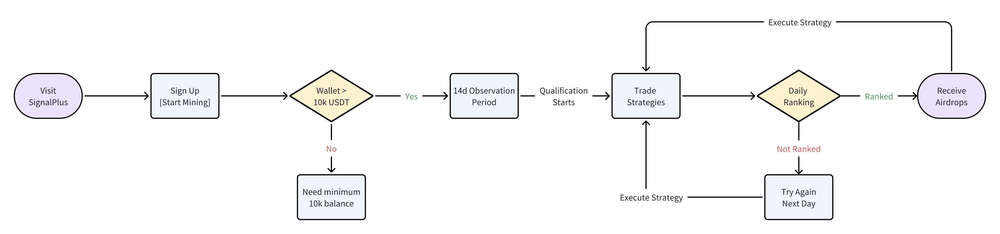
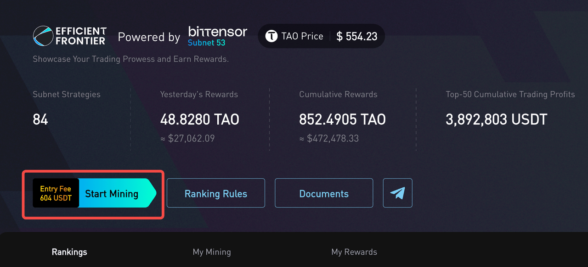
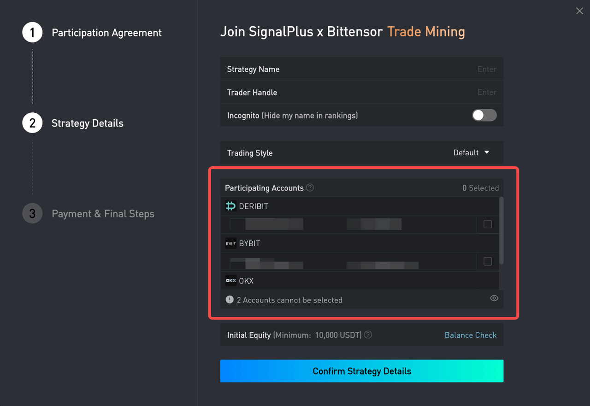
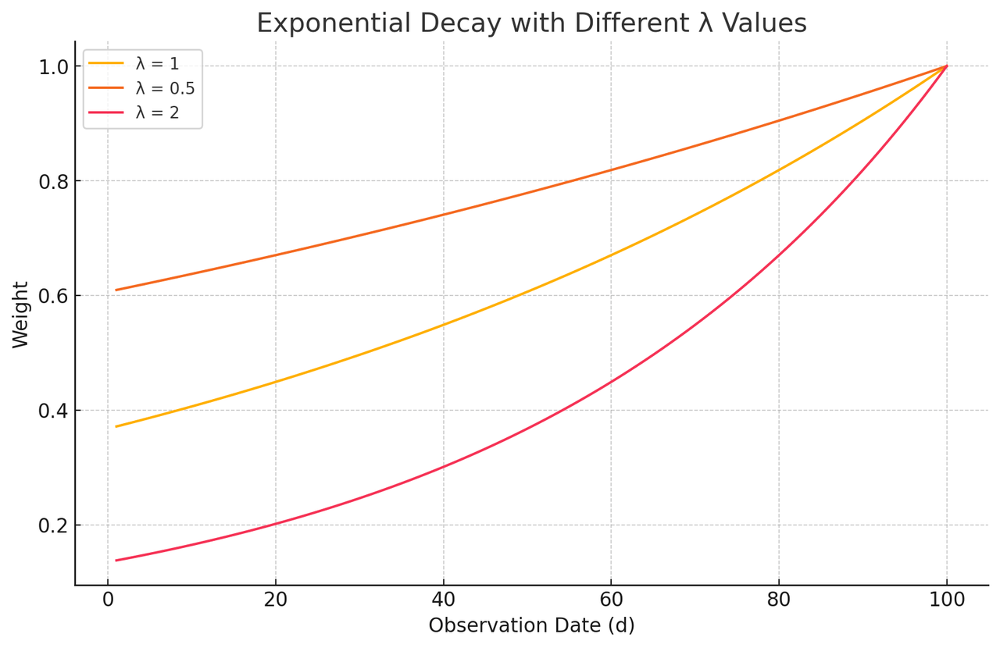
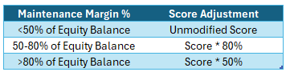
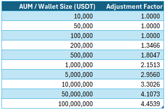
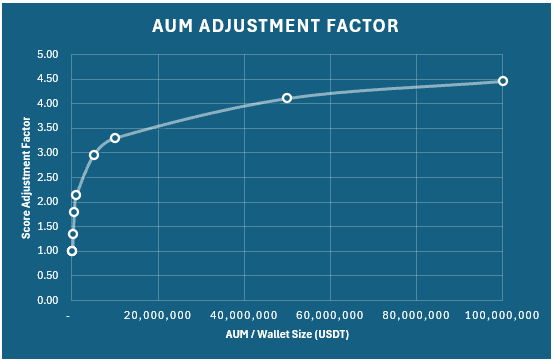

Last Updated: December 12th, 2024
Introduction: Showcase your trading strategies! Strategies that consistently deliver profits with minimal drawdowns will be eligible for substantial airdrops!

## Summary Flowchart

### 1. Participate in Mining
- Visit [t.signalplus.com](http://t.signalplus.com/)
- Click [Start Mining], bind your trading account to be showcased publicly, and pay the participation fee.
- ⚠️ Note: The initial equity in the linked account must be at least 10,000 USDT (or equivalent) to qualify for participation.

## 2. 14-Day Observation Period
- New strategies must undergo a 14-day observation period before becoming eligible for rewards. During this period, trading performance and behavior will be evaluated for ranking.

## 3.Ranking Rules

3.1 Overview

  Objective: The platform rewards strategies that consistently generate profits with minimal drawdowns while penalizing those suspected of unfair practices or low engagement.
  - Earn Airdrop Bonuses: Scores are calculated based on time-weighted returns (with today's weight being the highest). Positive scores will qualify for airdrop bonuses.
  - Scoring Formula: Scores are derived from the ratio of the strategy’s weighted daily returns to its maximum decayed drawdown.
  - Trading Day Definition: From 8:00 AM UTC to 8:00 AM UTC the next day.
  - Penalty for Violations: Strategies with positive returns that breach any rules in Section 3.3 will receive a score of zero for the day.
  
3.2 Ranking and Reward Distribution

  - Daily Ranking: Strategies are ranked based on their scores, with higher scores achieving higher ranks.
  - Reward Distribution:
    - Your score is compared to the total scores of all strategies, with higher scores earning a larger share of the rewards.
    - Only the top 50 strategies based on returns will qualify for rewards.
    - Rewards are distributed the following trading day after verification (refer to 3.1 for eligibility).
    - Reward Formula: Scores are calculated using the ratio of weighted daily returns to maximum decayed drawdown.
  
    Daily Score Formula:
$$\text{Strategy Score = } \frac {\text{Weighted Daily \\% Returns}}{\text{Maximum Decayed Drawdown}} \cdot 10$$
    
### 3.3 Violating Strategies

  Strategies with positive returns will receive a score of 0 for the day if they violate any of the following rules:
  1. Minimum Balance Requirement: Account balances must remain above 10,000 USDT (or equivalent) at the start and end of the trading day.
  2. Minimum Trading Volume: Total trading volume for the past 7 days must be at least 5,000 USDT, calculated as follows:
    
     - Options: Volume = Option Premiums
     - Futures and Spot: Volume = Order Quantity × Order Price × Token Ratio (based on cryptocurrency type and initial margin rates; see [OKX Margin Rates](https://www.okx.com/trade-market/position/swap) for details).
  3. Net Withdrawal Restriction: No net outflows (withdrawals > deposits) are allowed during the trading day.
  4. Whitelisted Assets: Only trades involving the following assets or their derivatives (spot, futures, options) will count toward scores:
     - BTC, ETH, SOL
     - USDT, USDC
     - ADA, AVAX, BCH, BNB, DAI, DOGE, DOT, LEO, LINK, SHIB, SUI, TAO, TON, TRX, XRP.
  5. Execution via SignalPlus: All eligible trades must be executed on the SignalPlus platform, except for liquidations or settlements handled by the exchange.
  6. No Wash Trades or Manipulative Activity:
  Strategies must be logical and educational, helping others learn and understand the market. Trades must reflect genuine market insights.
     - Strategies aiming to manipulate returns or undermine fairness will be disqualified, with all rewards forfeited.
     - Severe violations will lead to permanent disqualification and the recovery of any rewards that have been distributed.
    
### 3.4 Scoring Details

1. Daily Return Calculation

    At the end of each trading day, the platform will calculate the daily strategy PNL (in USDT). The return is derived by comparing the account balance at the start and end of the day, and adjusting for any deposits or withdrawals that might have occurred during the session.

       $_Return  = Balance_DayEnd - Balance_DayStart - Net_Inflows

2. Daily % Return Calculation

    The Daily % Return is calculated by dividing the Daily Return by the average balance for the day, adjusting for any deposits or withdrawals. This represents the daily percentage return of the strategy.

        %_Return = $_Return / Avg(Balance_DayStart, Balance_DayStart+Net_Inflows)

3. Weighted Historical Performance

    The performance of the strategy is exponentially weighted, giving more importance to recent results but still recognizing one's historical performance. Strategies that have performed better in the near term will receive higher scores.

    $$\text{Weighted Daily Returns = } \frac{\text{CrossProduct(DayWeights * Daily \\% Returns)}}{\text{Sum(DayWeights)}}$$

    $$\text{DayWeight} = \exp(-\lambda \cdot \text{Return Decay} \cdot \text {(Measurement Date - Inception Date}))$$

    $$\text{Return Decay =} \exp(\frac{\ln(20\\%)}{\text{14 Days}})$$

4. Trading Frequency (λ)

    In order to accommodate different trading styles, we will give users the option to define their trading styles to be 'Frequent', 'Base', or 'Infrequent'.  The trading style selection will affect the decay weights of daily returns, with faster decay giving more weights to recent returns (high frequency), and slower decay favouring historical performance.

    where λ = decay parameter
      - λ = 2, faster decay
      - λ  = 1, base decay
      - λ = 0.5, slower decay

   (Note: This feature is currently disabled while we fine-tune our parameters to the appropriate decay factors)
    
   

   To discourage inappropriate mis-use of the formula weights, there will be a 30-day cooldown period before a frequency change can be made again.

5. Maximum Decayed Drawdown

    The system measures the largest peak-to-trough capital drawdown incurred by the strategy on a life-to-date basis, but adjusted by a separate Drawdown Decay factor. A smaller drawdown will have a considerable impact on the final ranking score, rewarding strategies with strong risk discipline that can avoid taking large losses over time.

    $$\text{Min(Today's \\% Drawdown, (}\frac{\text{Trough Index Value}}{\text{Peak Index Value}}-1) \cdot \text{Drawdown Decay, -1\\%)}$$

    $$\text{Drawdown Decay =} \exp(\frac{\ln(80\\%)}{\text{14 Days}})$$

6. Excessive Risk Taking Adjustment

    Strategies that are excessively risk-levered with high margin usage will be subject to a score adjustment. Specifically, strategies that employ margin usage (as defined by the relevant CEX) in excess of 50% will see a 20% discount on their final score, and excesses of >80% will suffer a 50% discount.
   
    

7. AUM / Wallet Size Adjustment Factor

    For strategies achieving the same performance (i.e., return rate、drawdown), a higher AUM / wallet size will result in a higher score. This reflects the exponentially higher difficulty of managing larger portfolios, rewarding high-AUM strategies with an added scaling factor.
    
   
$$\text {AUM Adjustment Factor = Strategy Score} \cdot \text {(1+} \ln( \sqrt{ \max{(1, \frac{\text{AUM}}{100,000}})}$$

